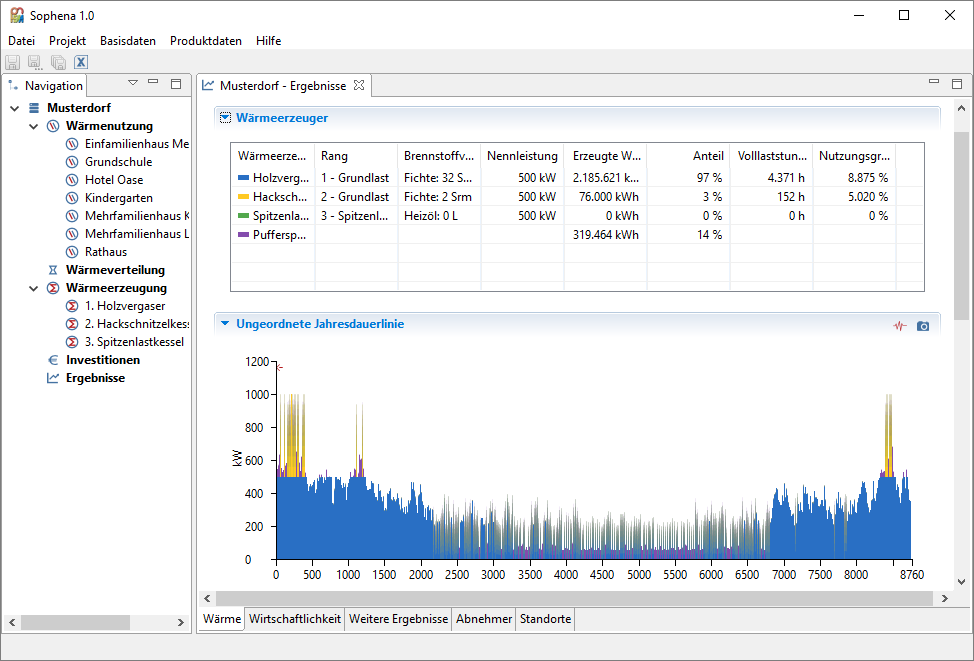

Sophena
=======
Sophena is a quick planning tool for local heating networks. See the 
[C.A.R.M.E.N. e.V. website](https://www.carmen-ev.de/infothek/downloads/sophena/1989-sophena-die-software)
for further information.



## Building from source
Sophena is an [Eclipse RCP application](https://wiki.eclipse.org/Rich_Client_Platform)
using the Eclipse 3.x API. In order to build it from source you need to have the
following tools installed:

* a Java Runtime or [JDK >= 8](http://www.oracle.com/technetwork/java/javase/downloads/jdk8-downloads-2133151.html)
* [Apache Maven](https://maven.apache.org/)
* the [Eclipse package for RCP & RAP developers](http://www.eclipse.org/downloads/eclipse-packages/).

Then, checkout the source code:

```bash
cd <your project folder>
git clone https://github.com/GreenDelta/Sophena.git
```

Start Eclipse, create a workspace, and import the projects in `<your project folder>/Sophena`
(`build`, `runtime`, `sophena`) via `Import > General > Existing Projects into Workspace`.
In the `runtime` project open the `build.xml` file and run it as `Ant Build`. This
will download and prepare the _Eclipse Target Platform_ of Sophena. When the
Ant Build finished, refresh the project (`F5`), open the file
`runtime/platform.target`, correct the platform link so that it points to your
`<your project folder>/Sophena/runtime/platform` folder, and press
`Set as Target Platform`.

Then, right click on the file `sophena/pom.xml` and run it as `Maven build` with
`package` as goal in the upcoming dialog. You can also do this from the console
via:

```bash
cd <your project folder>/Sophena/sophena
mvn package
``` 

After this, refresh the project.

### Building the database template
The application contains a database template that contains the base data of
Sophena. This template is extracted into the workspace if the database folder
`<WORKSPACE>/database` does not exist. The template is located in
`./sophena/resources/database.zip` and is currently generated via the
[BuildDb](./sophena/src/sophena/db/BuildDb.java) script which simply imports
the `./sophdat/gen/base_data.sophena` package in an empty database. Thus, you
first have to run the [sophdat](./sophdat) tool in order to create the database
template which is distributed with the application (see the README file there).

### Creating the distribution package
Currently we just build Windows versions but the target platform already
supports multi-platform builds. To create the distribution package, first export
the `sophena` project as `Eclipse product` within Eclipse:
`Export > Plugin Development > Eclipse product`. Choose the following settings:

* Configuration: `/sophena/sophena.product`
* Root directory: `Sophena`
* Destination directory: `../build/builds` (the builds folder in the sub-project
  `build`)
* Uncheck `Generate p2 repository`
* Check `Export for multiple platforms`

On the next page select the `win32/x86_64` platform and run the export. If
everything went well, the export should create a `build/builds/win32.win32.x86_64`
folder that contains the compiled product.

Finally, the script `make.bat` in the `build` folder copies a Java runtime into
the product folder and creates the distribution package. Therefore, an extracted
Java runtime v10 needs to bo located in the `build/jre/win64` folder and the
[7zip](https://www.7-zip.org/) exexutable in the `tools` folder.

## License
Unless stated otherwise, all source code of the Sophena project is licensed 
under the [Mozilla Public License, v. 2.0](http://mozilla.org/MPL/2.0/). Please 
see the LICENSE.txt file in the root directory of the source code.
