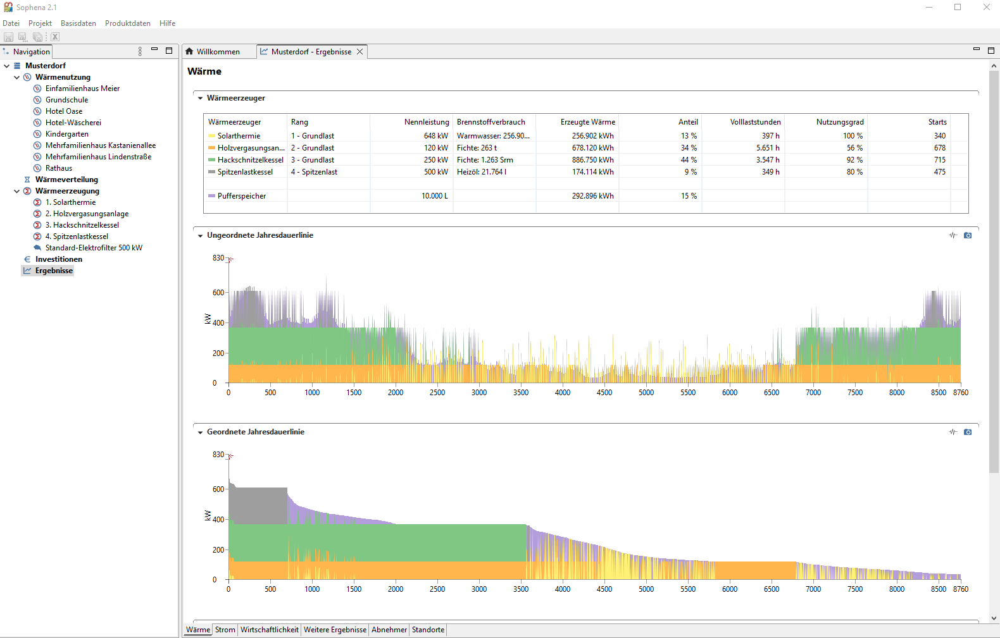

# Sophena

Sophena is a quick planning tool for local heating networks. See the 
[C.A.R.M.E.N. e.V. website](https://www.carmen-ev.de/service/sophena/)
for further information.



## Building from source

Sophena is an [Eclipse RCP application](https://wiki.eclipse.org/Rich_Client_Platform)
using the Eclipse 3.x API. In order to build it from source you need to have the
following tools installed:

* a Java Runtime or [JDK >= 17](https://adoptium.net)
* [Apache Maven](https://maven.apache.org/)
* the [Eclipse package for RCP & RAP developers](http://www.eclipse.org/downloads/eclipse-packages/).
* ([Go](https://golang.org/) for building the data packager)

Then, checkout the source code:

```bash
cd <your project folder>
git clone https://github.com/GreenDelta/Sophena.git
```

The `Sophena` folder contains two project:

- [sophena](./sophena) which is the Eclipse RCP application,

- [sophdat](./sophdat) which is a command line tool written in Go for building the data
  packages for Sophena

### Prepare the Eclipse workspace

Start Eclipse, create a workspace, and import the `sophena` project into it by
using the `Import > General > Existing Projects into Workspace` command. In the
project, open the `platform.target` file, load the platform and set it as the
target platform of your workspace using the `Set as Target Platform` command.

We manage our library dependencies with Maven. In Eclipse, you can right click on the `sophena/pom.xml` file and run it as `Maven build` with `package` as goal in the upcoming dialog. But you can also do this from the command line of course:

```bash
cd sophena
mvn package
```

This will copy the libraries into the `sophena/libs` folder. You may have to
refresh the project in Eclipse to update it.

### Building the database template

The application contains a database template that contains the base data of
Sophena. This template is extracted into the workspace if the database folder
`<WORKSPACE>/database` does not exist. The template is located in
`sophena/resources/database.zip` and is currently generated via the
[BuildDb](./sophena/src/sophena/BuildDb.java) script which simply imports
the `./sophdat/gen/base_data.sophena` package into an empty database. Thus, you
first have to run the [sophdat](./sophdat) tool in order to create the database
template (see the README file in the `sophdat` folder).

### Creating the distribution package

Currently we just build Windows versions but the target platform already
supports multi-platform builds. To create the distribution package, first export
the `sophena` project as `Eclipse product` within Eclipse:
`Export > Plugin Development > Eclipse product`. Choose the following settings:

* Configuration: `/sophena/sophena.product`
* Root directory: `Sophena`
* Destination directory: `.sophena/build/builds` (the builds folder in the sub-project
  `build`)
* Uncheck `Generate p2 repository`
* Check `Export for multiple platforms`

On the next page select the `win32/x86_64` platform and run the export. If
everything went well, the export should create a `build/builds/win32.win32.x86_64`
folder that contains the compiled product.

Finally, the script `make.bat` in the `build` folder copies a Java runtime into
the product folder and creates the distribution package. Therefore, an extracted
Java runtime needs to be located in the `build/jre/win64` folder and the
[7zip](https://www.7-zip.org/) executable in the `tools` folder.

## License

Unless stated otherwise, all source code of the Sophena project is licensed 
under the [Mozilla Public License, v. 2.0](http://mozilla.org/MPL/2.0/). Please 
see the LICENSE.txt file in the root directory of the source code.
